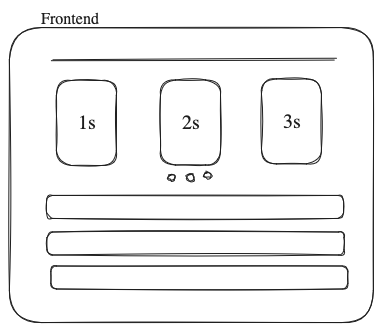

# Player Availability Tracker

## Table of Contents

- [Project Outcomes](#outcomes)
- [Wireframe](#wireframe)

## Outcomes

### User Outcomes

1. Get team sheet for a particular weekend
2. Get game day calendar
3. Get practice day calendar
4. Approximate traning numbers
5. Role based access permissions

#### Stretch Targets

1. Socials integration
2. Club website integration

### Technical Outcomes

1. Two availability zones
2. Email notifications for outages
3. Production level logging for debugging
4. Accessible REST API
5. Mobile-first frontend design
6. Kubernetes learning
7. Free tier usage

#### API Schematic

```
GET /fixtures
    GET /fixtures/:fixtureId
    PUT /fixtures/:fixtureId
    DELETE /fixtures/:fixtureId
POST /fixtures
GET /players
    GET /players/:playerId
    PUT /players/:playerId
POST /players
GET /clubs
POST /clubs
    GET /clubs/:clubId
    PUT /clubs/:clubId

GET /oauth2/connect  
```

## Wireframe

